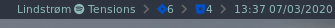
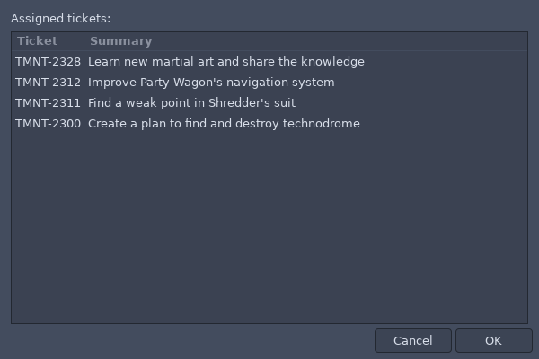

# JIRA i3 blocklet



This blocklet shows number of assigned JIRA tickets. When clicked the window (zenity) with a list of ticket's ids and summary appears, selected ticket will be opened in browser:



## Requirements

 - font awesome - to display a JIRA's icon (Brands subset would be enough)
 - curl - to call JIRA's REST API
 - setup [netrc](https://ec.haxx.se/usingcurl/usingcurl-netrc) - a feature of curl which allows to use basic auth credentials from a file Basically you just need to create a following file in home folder (don't forget to change file's permissions - `chmod 600 ~/.netrc`):

    ```bash
    machine turtlejira.com
    login mikey@tmnt.com
    password cowabunga
    ```

 - jq - to parse response from JIRA's REST API
 - zenity - to show a popup

 # Installation

Install [i3blocks](https://github.com/vivien/i3blocks) then clone the repo under `~/.config/` and then use in i3's config:

```
[jira]
label=<span foreground="#0052CC"></span>
markup=pango
color=#8FBCBB
interval=10
host=https://somehost.jira.com
```