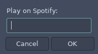

# Spotify Blocklet

An i3blocks blocklet which shows a currently playing song and allows to control [Spotify client for Linux](https://www.spotify.com/ca-en/download/linux/):


## Features

 - show currently playing song
 - mouse control:
    - scroll up - next song
    - click - play/pause
    - scroll down - previous song

## Installation

Install [sp](https://gist.github.com/streetturtle/fa6258f3ff7b17747ee3) script which allows to control Spotify client from terminal (using dbus protocol):

```bash
git clone https://gist.github.com/fa6258f3ff7b17747ee3.git
cd ./fa6258f3ff7b17747ee3
chmod +x
sudo ln -s ./sp /usr/local/bin/
```

After it's installed you can test it (`sp help`).

Then add spotify folder to your i3blocks folder and create a blocklet in config:

```bash
[spotify]
interval=1
color=#8FBCBB
```

## More cool stuff :tada:

Shortcuts:

```bash 
# Spotify
bindsym $mod+slash exec --no-startup-id sp play
bindsym $mod+period exec --no-startup-id sp next
bindsym $mod+comma exec --no-startup-id sp prev
bindsym $mod+d exec "zenity --entry --text 'Play on Spotify:' | xargs sp" # details below
```

`sp` can start playing the best search result for the given query if you type `sp something`. By combining it with [zenity](https://en.wikipedia.org/wiki/Zenity) you can have a super quick way to play something on Spotify. Note that for this feature you need to add your id and secret (from [here](https://developer.spotify.com/)) to the `sp` script. 




