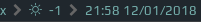

# Weather i3 blocklet

Weather blocklet which shows weather condition icon and temperature:

# Requirements

 - Get an [API key](http://openweathermap.org/appid).

 - Install jq - command-line JSON processor which simplifies parsing the API response. It should be available in the default repos.

 - This blocklet uses custom icons (FontAwesome doesn't have enough weather icons) so you'll need to install them first. I used [Weather Icons Font Set by Pixeden](http://themes-pixeden.com/font-demos/the-icons-set/weather/). Download it, unzip, then copy the **/assets/fonts/pe-icon-set-weather.ttf** under **~/.local/share/fonts** and then install this font by refreshing font cache: `fc-cache -fv`. Probably you'll also need to relogin.

 - Make **weather** script executable (`chmod +x ./weather`).
